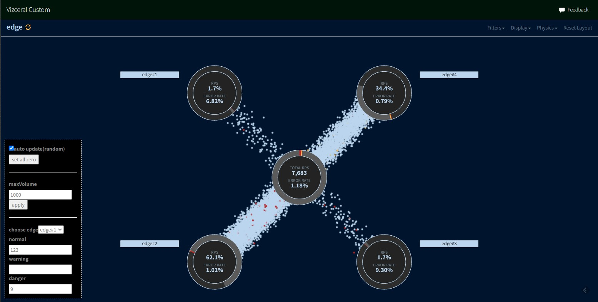

# Vizceral Example with dynamic traffic data
  This is a clone of [Vizceral Example](https://github.com/netflix/vizceral-example) with which you can vary traffic data and verify resulting vizualization.

# Setup
1. Get source, install deps, and run demo server.

   ```sh
   git clone https://github.com/ryuken73/vizceral_custom.git
   cd vizceral-custom
   npm install
   npm run dev
   ```

2. Open `localhost:8080` in your browser.

# Source Change
- Almost all changes are in trafficFlow.jsx

# Screen Shot
